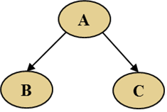
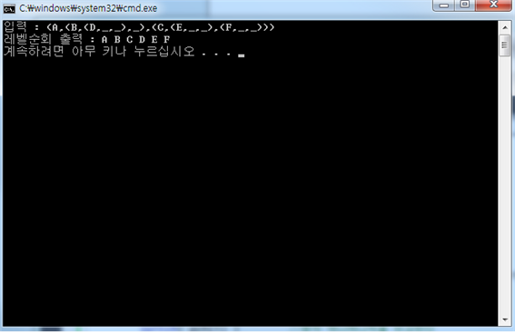

BINARY-TREE-LEVER-TREE
===
### Date: 2014-05~
#### university programming assignments.
-------------

이번에 구현한 자료구조는 이진트리 중첩된 괄호 레벨순회법 출력입니다. 사용자로부터 입력을 받은 문자를 가지고 이진트리를 구현한 후 레벨순회법으로 출력하는 것입니다. 대략적으로 (A,(B,_,_),(C,_,_))라는 입력을 받았을 때
A라는 부모노드와 자식노드 B, C왼쪽오른쪽으로 노드를 삽입하는 프로그램입니다. 중첩된 괄호를 이용하여 규칙성을 찾아서 프로그램을 작성하였습니다.

먼저 제가 찾은 규칙은 첫 번째, ‘(’라는 괄호가 나오면 무조건 DATA, 즉 문자가 온다는 규칙입니다. 두 번째, ‘,’라는 문자가 첫 번째면 왼쪽에 삽입이 되고 두 번 나오면 오른쪽에 삽입이 된다는 규칙입니다. 이런 규칙을 가지고 트리에 저장 후 “레벨순회법“을 큐를 이용해서 코딩하였습니다.
먼저 문자 체크함수입니다.
<pre><code>TreeNode* checking_ch(char *pch)
{
	TreeNode *new_node = NULL;		//새로운 노드
	TreeNode *n = NULL;			//루트노드
	int i = 0;
	LinkedStackType *L = (LinkedStackType*)malloc(sizeof(LinkedStackType));	//스택을 생성한다.
	stack_init(L);	//스택을 초기화하고

	for( i = 0; pch[i] != NULL; i++)	//문자열 NULL이 될때까지 포문/
	{
		switch( pch[i] )		//문자 하나하나씩을 비교한다
		{
		case '(':
			new_node = createNode(pch[++i]);	//(다음에는 문자가 오기때문에 트리노드를 생성하고 new_node에 집어넣는다
			break;
		case ',':
			new_node->count++;		//','갯수만큼 ++한다
			if( pch[i+1] == '(' ) push(L, new_node);	//만약 ','다음이 '('이면 현재 노드를 스택에 집어 넣는다
			break;
		case ')':
			if( !stack_is_empty(L))		//스택이 안비어있으면
				n = pop(L);		//괄호가 끝나면 부모노드를 다시 n에 넣는다.
			else
				break;

			if( n->count == 1 )	//n이 count가 1이면
				n->left = new_node;	//부모노드 왼쪽에 넣고
			else if( n->count == 2)	//2이면
				n->right = new_node;	//오른쪽에 넣는다.

			new_node = n;	//그리고 다시 new_node에 n을 넣는다.
			break;
		}
	}

	return new_node;	//최종적인 노드를 반환한다.
}</pre></code>

함수를 보듯이 문자 하나하나씩 for문으로 NULL값이 될 때까지 반복을 하여 줍니다. 
‘(’가 나오면 바로 문자가 나오는 첫 번째 규칙성을 이용하여 new_node에 새로운 노드를 생성하고 data와 링크를 초기화 해주고 대입해줍니다. (그림 3 참고)
<pre><code>element createNode(char ch)	//새로운 노드를 생성하고 초기화 하는 함수
{
	element newNode = (TreeNode*)malloc(sizeof(TreeNode));
	newNode->data = ch;
	newNode->count = 0;
	newNode->left = NULL;
	newNode->right = NULL;
	return newNode;
}</pre></code>

다음 ‘,’가 나오는 것을 확인 해줍니다. ‘,’가 나오는 순간 ,의 개수를 확인하기 위하여 각 트리 노드 안에 있는 count를 +1해줍니다. ‘,’가 1개나오면 왼쪽노드로 가게 되고 2개 나오면 오른쪽 노드로 가기 위함입니다. 또 ‘,’가 나올 때 다음 문자는 2가지 문자가 나올 수 있습니다. 데이터 문자가 나올 수 있고 NULL값을 가리키는 ‘_’가 나올 수 있는데 if문을 이용하여 다음이 ‘(’면 스택에 노드를 push해줍니다. 
다음 ‘)'가 나오면 스택안에 있는 노드를 pop해주고 n에 저장을 합니다. 그리고 n에 카운트를 확인하여 1이면 왼쪽노드에 새로운 노드를 연결해주고 count가 2면 오른쪽 노드에 새로운 노드를 연결해줍니다. 그리고 다시 new_node에 n을 넣어줍니다.

이런식의 규칙을 이용하여 문자열을 체크하고 트리에 저장을 하였습니다. 다음 “레벨순회법“입니다. 
<pre><code>void level_order(TreeNode *ptr)	//순회함수
{
	QueueType q;
	init(&q);	//큐를 초기화 하고
	if (!ptr) return;
	enqueue(&q, ptr);	//큐에 노드를 넣고
	while (!is_empty(&q)){		//안비어있으면
		ptr = dequeue(&q);	//하나씩 꺼낸다.
		printf("%c ", ptr->data);
		if (ptr->left)
			enqueue(&q, ptr->left);
		if (ptr->right)
			enqueue(&q, ptr->right);
	}
}</pre></code>

먼저 큐를 초기화 하고 큐에 노드를 넣습니다. 그리고 큐가 공백상태가 될 때까지 하나씩 꺼내고 데이터를 출력하고 노드의 왼쪽과 오른쪽이 NULL값이 아닐 때 또 큐에 노드를 넣고 레벨적으로 순회하는 함수입니다.

예) 입력 : (A,(B,(D,_,_),_),(C,(E,_,_),(F,_,_)))	출력 : ABC

